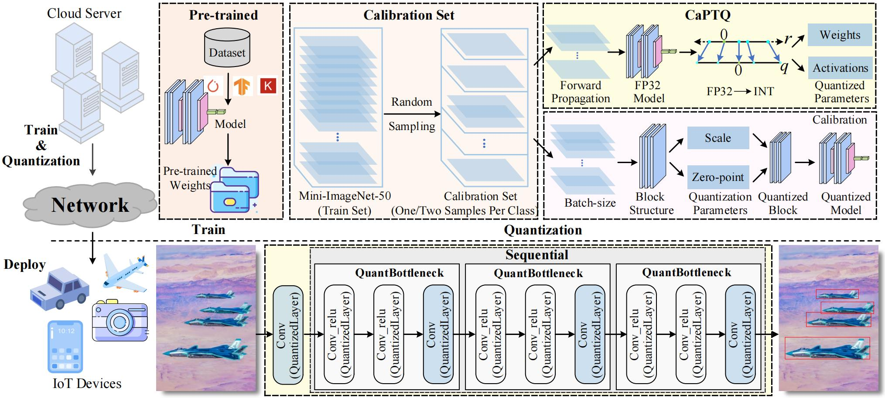
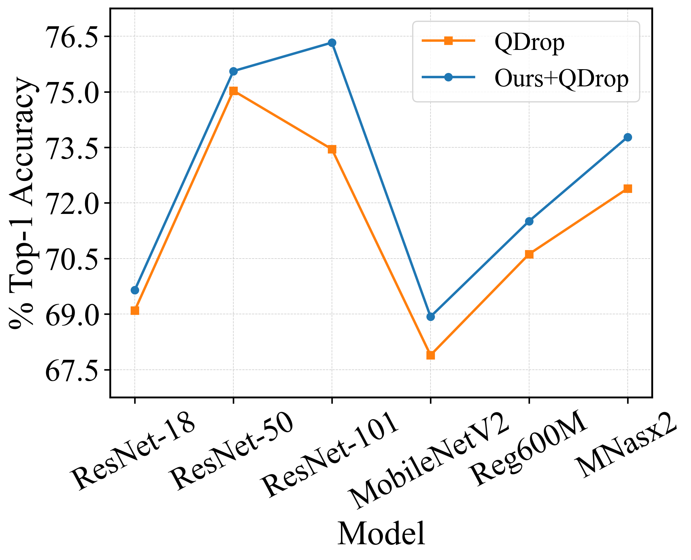
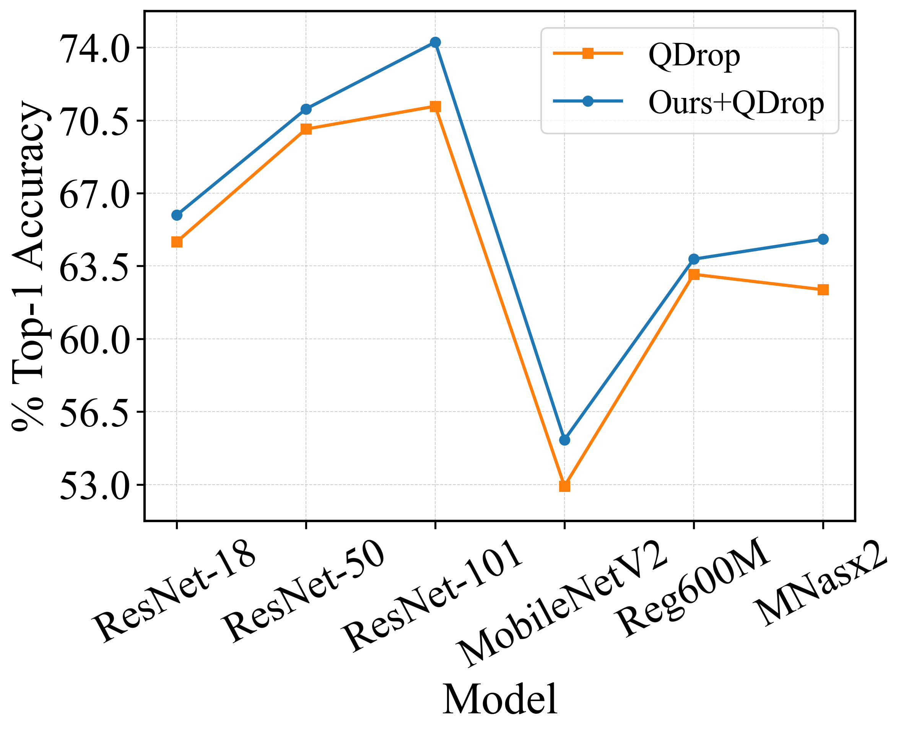

# CaPTQ
## 介绍
本仓库提供我们论文 CaPTQ: Calibration Data Selection for Visual Services based on Post-training Quantization 的代码实现（目标检测部分的代码将于稍后在本仓库更新）。

在云上训练高性能的神经网络模型，将其量化为低比特，并将这些低比特模型部署到无处不在的物联网（IoT）设备上，从而以较低的资源需求和快速响应提供高质量的视觉服务（例如，图像分类和物体检测）已成为主流。然而，现有的PTQ方法存在低位模型性能低和所需校准数据数量多导致大量资源消耗的局限性。为此，本研究提出了一种校准数据选择方法CaPTQ。具体来说，首先，通过分析量化过程中的误差累加效应，探究校准数据在量化过程中的具体作用。其次，为了克服现有PTQ方法在低比特条件下性能损失严重的问题，提出在校准过程中选择像素分布平滑的数据，以逐层/块减少舍入和重构损失，从而提升量化模型性能。然后，我们提出了无放回的随机采样策略，解决微调量化模型所需校准数据数量多的问题，确保量化模型在物联网设备端的高性能运行。最后，我们在分类和检测任服务上充分验证了CaPTQ算法的有效性。

<figure style="text-align:center; margin: 0;">
  
  <figcaption style="font-size:85%;">
    <em>图 1: 所提出框架的概述。我们首先在云服务器上使用所提出的CaPTQ方法对已训练的CNN模型进行量化，然后将量化后的模型发送至物联网设备进行部署。我们的目标是通过选择合适的校准数据来减少量化损失并降低所需校准数据的数量。</em><br>
  </figcaption>
</figure>

## 文件结构
```
CaPTQ
├── exp/                                [Quantization Configuration]
│   ├── w4a4                            [Quantize weights and activations to 4 bits]
│   |   ├──rs101                        [ResNet-101 model]
│   |   |   ├──config.yaml              [Specific quantization settings: model type, weight/activation quantization methods, and optimization parameters for calibrating the quantized model.]
│   ├── w2a4                            [Quantize weights to 2 bits, activations to 4 bits]
│   ├── w3a3                            [Quantize weights to 3 bits, activations to 3 bits] 

├── imagenet/                           [ImageNet-1K dataset]
│   ├── val                             [Used for testing accuracy]   
│   ├── sel                             [Calibration data: Randomly select 1,024 images from the ImageNet-1K training set or a subset thereof, covering all classes (at least one image per class), to serve as the quantization calibration set for optimizing quantization parameters and reducing error.]

├── model_zoo/                          [Repository of pretrained model checkpoints]
│   ├── resnet18_imagenet.pth.tar       [ImageNet-pretrained ResNet-18 checkpoint (tar archive)]   
│   ├── resnet50_imagenet.pth.tar       [ImageNet-pretrained ResNet-50 checkpoint (tar archive)]
│   ├── resnet101_imagenet.pth          [ImageNet-pretrained ResNet-101 checkpoint]

├── model_quantized/                    [Saving of quantized models]
│   ├── resnet101_imagenet_w4_a4        [Quantize both the weights and activations of the ResNet-101 model to 4 bits, and save the resulting quantized model]
│   |   ├── resnet101_w4_a4_13027.pth   [Quantize both the weights and activations of the ResNet-101 model to 4 bits using calibration data sel_3, and save the resulting quantized model]
│   |   ├── resnet101_w4_a4_63649.pth   [Quantize both the weights and activations of the ResNet-101 model to 4 bits using calibration data sel_2, and save the resulting quantized model]

├── calibquant/  
├── ├── model/                          [Model definition files]
│   |   ├── resnet.py                   [ResNet model definition file]
│   |   ├── mobilenetv2.py              [MobileNetV2 model definition file]

│   ├── quantization/                   [Quantization tools]
│   │   ├── fake_quant.py               [Implement quantize and dequantize functions]   
│   │   ├── observer.py                 [Collect the information of distribution and calculate quantization clipping range]     
│   │   ├── state.py                    [Set quantization states]
│   │   ├── quantized_module.py         [Quantization wrapper: injects weight and activation quantization into Linear/Conv/Embedding modules, supporting methods like LSQ/LSQ+ and AdaRound with various observers]
│   │   ├── util_quant.py               [Per-tensor/per-channel affine quantization functions]
│   │   ├── util_log.py                 [Generate training/testing logs]

│   ├── solver/ 
│   |   ├── imagenet_util.py            [Load ImageNet-1K dataset]
│   |   ├── recon.py                    [Reconstruct models]
│   |   ├── fold_bn.py                  [Fold adjacent BatchNorm layers into the preceding convolution/fully connected layers and remove BN]
│   |   ├── main_imagenet.py            [Run quantization on imagenet dataset]
│   |   ├── test_imagenet.py            [Run accuracy testing with the quantized model]
│   |   ├── test.py                     [Run testing to evaluate the accuracy of the original, unquantized model on the ImageNet dataset]

├── train_log/                          [Save logs during the quantization process]
│   ├── resnet101_imagenet              [Save logs during the ResNet-101 model quantization process.]
│   |   ├── calibquant_W4A4_46885/      [Save logs during the quantization of the ResNet-101 model to W4A4 (using calibration data sel_3, with the quantized file saved as "model_quantized/resnet101_imagenet_w4_a4/resnet101_w4_a4_13027.pth")]
│   |   ├── calibquant_W4A4_46885/      [Save logs during the quantization of the ResNet-101 model to W4A4 (using calibration data sel_2, with the quantized file saved as "model_quantized/resnet101_imagenet_w4_a4/resnet101_w4_a4_63649.pth")]
│   |   ├── calibquant_W4A4_61791       [Save logs during the quantization of the ResNet-101 model to W4A4 (using calibration data sel_1)]
│   |   ├── calibquant_W2A4_12393       [Save logs during the quantization of the ResNet-101 model to W2A4 (using calibration data sel_3)]
│   |   ├── calibquant_W2A4_52486       [Save logs during the quantization of the ResNet-101 model to W2A4 (using calibration data sel_2)]
│   |   ├── calibquant_W2A4_37478       [Save logs during the quantization of the ResNet-101 model to W2A4 (using calibration data sel_1)]

├── test_log/                           [Save logs during the testing process of the quantized model]
│   ├── resnet101_imagenet              [Save logs during the testing process of the quantized ResNet-101 model]
│   |   ├── calibquant_W4A4_61901       [Save logs during the testing process of the ResNet-101 model quantized to W4A4 (using calibration data sel_3)]
│   |   ├── calibquant_W4A4_19780       [Save logs during the testing process of the ResNet-101 model quantized to W4A4 (using calibration data sel_2)]
│   |   ├── calibquant_W4A4_34811       [Save logs during the testing process of the ResNet-101 model quantized to W4A4 (using calibration data sel_1)]
```

## 环境配置
```text
GPU: 1 Card（NVIDIA A100 Tensor Core GPU）
CPU: 4 Core
Memory: 20 GB
Block Storage: 50 GB
Operating System: Linux
Programming Language: Python（3.8）
```

### 创建虚拟环境
```shell
conda create -n calibquant_py38 python=3.8
```
### 激活虚拟环境
```shell
conda activate calibquant_py38
```
### 安装其它配置
```shell
pip install torch==1.8.1+cu111 torchvision==0.9.1+cu111 torchaudio==0.8.1 -f https://download.pytorch.org/whl/torch_stable.html

pip install PyYAML

pip install easydict

pip install scipy
```

## 量化模型
进入 `exp/w4a4` 目录，可以找到每种模型架构的 `config.yaml` 文件，执行 `main_imagenet.py` 即可量化指定模型的权值和激活值至4bit。对于其它比特设置，只需在 yaml 文件中更改相应的比特数即可。 

要在 ImageNet-1K 数据集上将 ResNet-101 模型量化为较低的比特位宽，可以轻松地使用 Shell 命令来实现。例如，要将 ImageNet-1K 数据集上的 ResNet-101 模型量化为 W4A4，只需执行以下命令：

```shell
cd CaPTQ

# Quantize the ResNet-101 model to W4A4
python ./calibquant/solver/main_imagenet.py --config ./exp/w4a4/rs101/config.yaml
```
此命令启动量化过程，允许直接在 ImageNet 数据集上将 ResNet101 模型转换为指定的较低比特精度。

## 保存量化模型的权重文件
在模型量化的过程中，量化后的模型结构及其参数会被完整保存。例如，在将 ResNet-101 模型量化为 W4A4 的情况下，量化后的模型和参数存储在名为 `model_quantized/resnet101_imagenet_w4_a4` 的文件夹中的 `.pth` 文件里。

文件名遵循格式 `resnet101_w4_a4_[random_number].pth`，其中 `[random_number]` 是一串随机数字。这个随机数字的目的是为了区分每个保存的量化文件，确保文件名的唯一性。

例如，一个特定的文件名可能是 `resnet101_w4_a4_13027.pth`，其中 `13027` 是随机生成的数字。这种方法允许用户轻松识别和管理不同批次量化产生的模型文件。

## 测试量化模型

可以使用 Shell 命令轻松评估先前保存的量化模型文件的性能。例如，要评估在 ImageNet-1K 数据集上量化为 W4A4 的 ResNet-101 模型的准确性，只需运行以下命令：

```shell
python ./calibquant/solver/test_imagenet.py --config ./exp/w4a4/rs101/config.yaml --quantized_model_path resnet101_w4_a4_13027.pth
```

需要注意的是，"--quantized_model_path" 后面的参数应该是已保存的量化模型文件的路径。这样，可以快速测试已保存的量化模型在指定数据集上的性能，而无需重新进行量化。只需提供已保存的量化模型文件的路径，测试脚本就会评估其在指定数据集上的有效性。

## 实验结果

我们在ImageNet-1K数据集上进行了图像分类服务的评估实验，主要包括随机选取一小部分训练数据作为校准数据，对量化过程进行校准，并在验证集上评估我们方法的有效性。我们选择的基准网络模型为不同规模的ResNet系列网络、MobileNetV2、Reg600M和MNasx2。我们得出两个结论：

(i) 我们的方法能够提升多个量化位宽下模型的精度。如图2所示，在W4A4量化配置下，基于ResNet101模型，QDrop的精度为72.98%，我们的方法达到了76.33%，实现了2.88%的提升。在W2A4量化配置下，基于MNasx2模型，QDrop的精度为62.36%，我们方法的精度为64.79%，提高了2.43%。在W3A3量化配置下，基于MobileNetV2模型，QDrop的精度为54.27%，我们方法的精度为57.76%，提高了3.49%。

<figure style="text-align:center; margin:0;">

  <!-- (a) -->
  <figure style="margin:0 0 10px 0;">
    
    <figcaption style="font-size:85%;"><em>(a) W4A4</em></figcaption>
  </figure>

  <!-- (b) -->
  <figure style="margin:12px 0 10px 0;">
    
    <figcaption style="font-size:85%;"><em>(b) W3A3</em></figcaption>
  </figure>

  <!-- (c) -->
  <figure style="margin:12px 0 10px 0;">
    
    <figcaption style="font-size:85%;"><em>(c) W2A4</em></figcaption>
  </figure>

  <!-- 总图注 -->
  <figcaption style="font-size:85%; margin-top:8px;">
    <em>图 2: Ours+QDrop 和 QDrop 方法在 ImageNet-1K 数据集上的 Top-1 表现对比。参照 BRECQ，我们将模型的第一层和最后一层保持为 8 位。</em>
  </figcaption>
</figure>
<div style="height:12px;"></div>

（ii）我们的方法在W2A2等低比特量化位宽下展现出显著的精度提升。如表1所示，基于ResNet18模型，BRECQ的精度为42.54%，我们方法的精度为42.68%，提高了0.14%。而QDrop的精度为51.14%，我们方法的精度达到了55.26%，提高了4.12%。基于ResNet101模型，QDrop的精度为59.68%，我们的方法的精度为64.32%，提高了4.64%。基于MobileNetV2模型，QDrop的精度为8.46%，我们的方法的精度为14.47%，提高了6.01%。
<div align="center" style="font-size:85%; line-height:1.25;">
<table style="text-align:center;">
  <caption style="caption-side:top; text-align:center; font-size:95%; margin-bottom:6px;">
    <em>表 1: 量化设置为 W2A2 时，我们的方法与典型 PTQ 方法在 ImageNet-1K 数据集上的 Top-1 表现对比。请注意，参考 BRECQ，我们将模型的第一层和最后一层保持为 8 位。</em>
  </caption>

  <thead>
    <tr>
      <th style="text-align:center;">Methods</th>
      <th style="text-align:center;">Bits (W/A)</th>
      <th>ResNet18</th>
      <th>ResNet50</th>
      <th>ResNet101</th>
      <th>MobileNetV2</th>
      <th>Reg600M</th>
      <th>MNasx2</th>
    </tr>
  </thead>
  <tbody>
    <tr>
      <td style="text-align:center;">Full Prec.</td>
      <td style="text-align:center;">32/32</td>
      <td>71.01</td><td>76.63</td><td>77.37</td><td>72.20</td><td>73.71</td><td>76.68</td>
    </tr>
    <tr>
      <td style="text-align:center;">BRECQ&#8224;</td>
      <td style="text-align:center;">2/2</td>
      <td>42.54</td><td>17.68</td><td>9.60</td><td>0.24</td><td>3.24</td><td>0.49</td>
    </tr>
    <tr style="background:#f2f2f2;">
      <td style="text-align:center;">Ours+BRECQ&#8224;</td>
      <td style="text-align:center;">2/2</td>
      <td style="white-space:nowrap;">42.68&nbsp;<span style="color:#c00;font-size:70%;">(+0.14)</span></td>
      <td style="white-space:nowrap;">18.86&nbsp;<span style="color:#c00;font-size:70%;">(+1.65)</span></td>
      <td style="white-space:nowrap;">10.86&nbsp;<span style="color:#c00;font-size:70%;">(+1.26)</span></td>
      <td style="white-space:nowrap;">0.24&nbsp;<span style="color:#c00;font-size:70%;">(+0.00)</span></td>
      <td style="white-space:nowrap;">3.43&nbsp;<span style="color:#c00;font-size:70%;">(+0.19)</span></td>
      <td style="white-space:nowrap;">0.59&nbsp;<span style="color:#c00;font-size:70%;">(+0.10)</span></td>
    </tr>
    <tr>
      <td style="text-align:center;">QDrop</td>
      <td style="text-align:center;">2/2</td>
      <td>51.14</td><td>54.74</td><td>59.68</td><td>8.46</td><td>38.90</td><td>22.70</td>
    </tr>
    <tr style="background:#f2f2f2;">
      <td style="text-align:center;">Ours+QDrop</td>
      <td style="text-align:center;">2/2</td>
      <td style="white-space:nowrap;">55.26&nbsp;<span style="color:#c00;font-size:70%;">(+4.12)</span></td>
      <td style="white-space:nowrap;">59.84&nbsp;<span style="color:#c00;font-size:70%;">(+5.10)</span></td>
      <td style="white-space:nowrap;">64.32&nbsp;<span style="color:#c00;font-size:70%;">(+4.64)</span></td>
      <td style="white-space:nowrap;">14.47&nbsp;<span style="color:#c00;font-size:70%;">(+6.01)</span></td>
      <td style="white-space:nowrap;">42.55&nbsp;<span style="color:#c00;font-size:70%;">(+3.65)</span></td>
      <td style="white-space:nowrap;">29.74&nbsp;<span style="color:#c00;font-size:70%;">(+7.04)</span></td>
    </tr>
  </tbody>
</table>
</div>