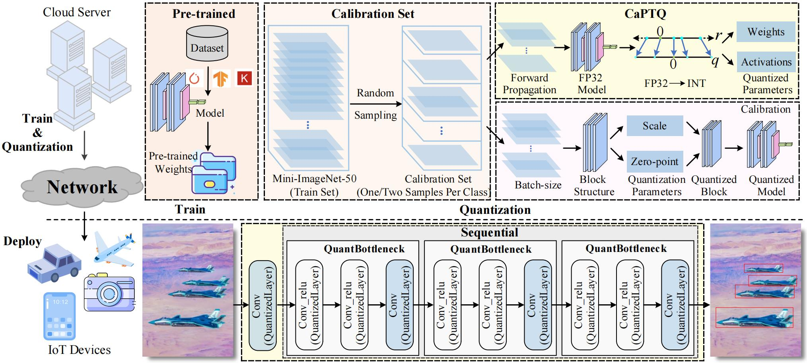
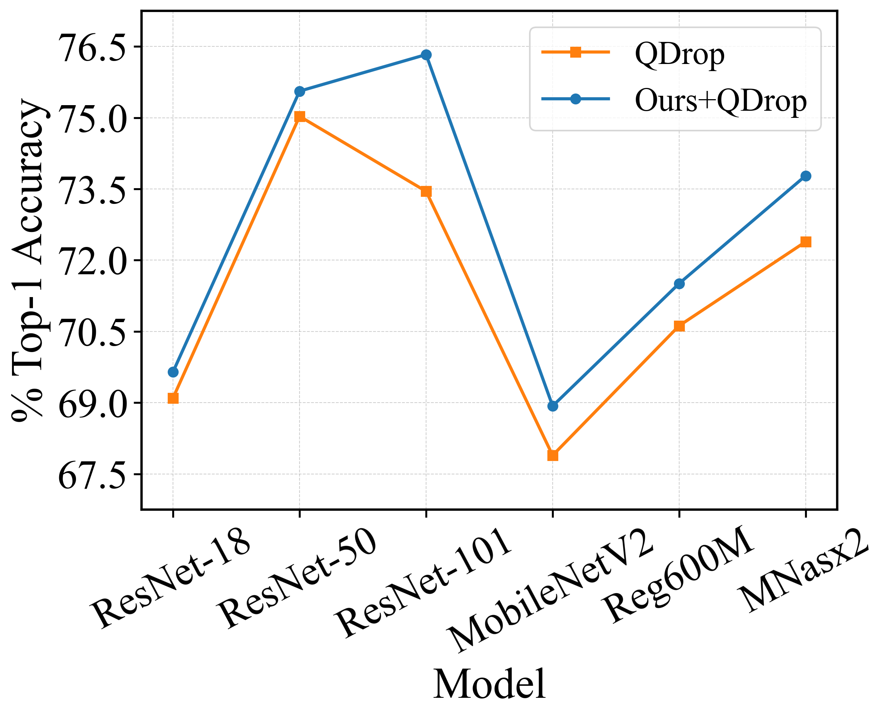
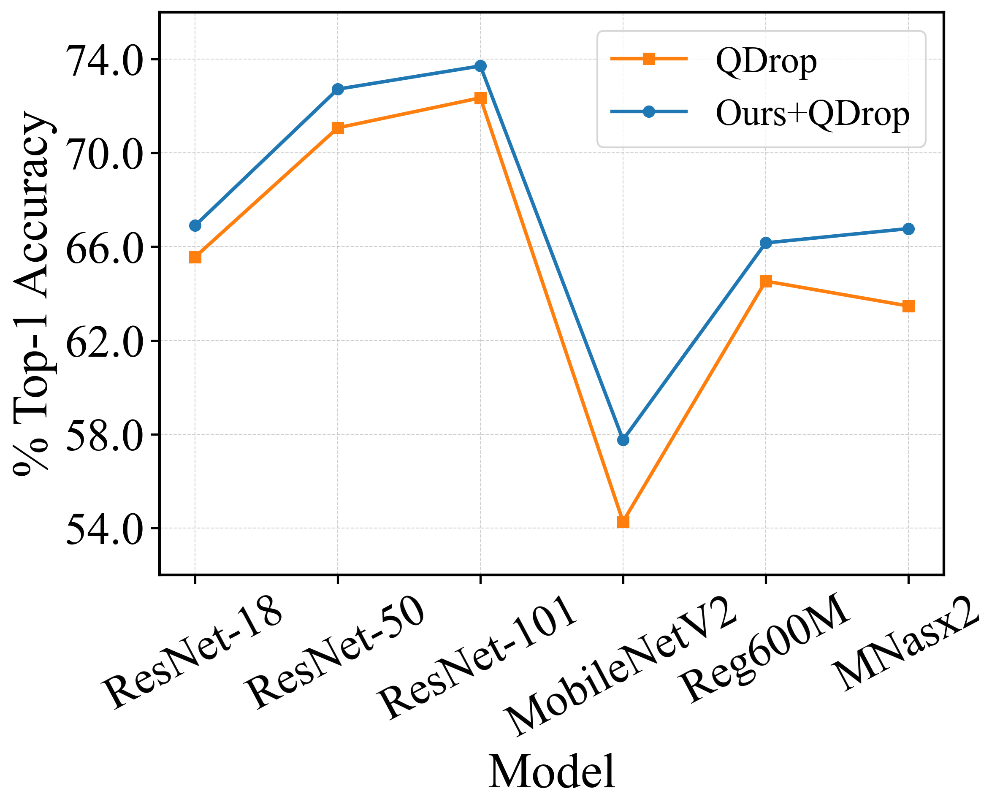
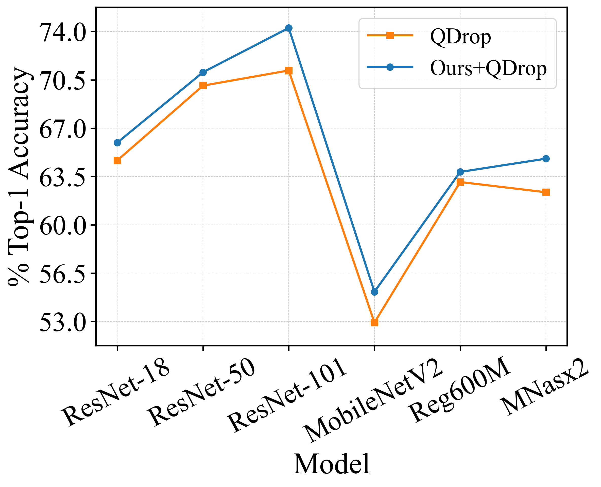

# CaPTQ

## Introduction

This repository provides the official code implementation of our paper CaPTQ: Calibration Data Selection for Visual Services Based on Post-Training Quantization. The object detection component will be made available in this repository in a future update.

Training high-performance neural network models in the cloud, quantizing them into low-bit representations, and deploying these compact models on ubiquitous Internet of Things (IoT) devices has become mainstream. This paradigm enables the delivery of high-quality visual services (e.g., image classification and object detection) with reduced resource demands and rapid response times. However, existing post-training quantization (PTQ) methods face two major limitations: degraded performance of low-bit models and substantial resource consumption due to the large amount of calibration data required.

To address these challenges, we propose a calibration data selection method, termed CaPTQ. Specifically, we first analyze the error accumulation effect during quantization to investigate the precise role of calibration data in this process. Second, to mitigate the severe performance degradation of existing PTQ methods under low-bit settings, we propose selecting data with smoother pixel distributions during calibration, thereby reducing rounding and reconstruction losses layer by layer or block by block and improving quantized model performance. Third, we introduce a random sampling strategy without replacement to alleviate the excessive calibration data requirement during fine-tuning, ensuring efficient deployment of quantized models on IoT devices. Finally, the effectiveness of CaPTQ is thoroughly validated on both classification and detection tasks.

<p align="center">
  <br>
  <em>Fig. 1: Overview of the proposed framework. We first apply the proposed CaPTQ method to quantize pre-trained CNN models on a cloud server, and then deploy the quantized models to IoT devices. The goal is to reduce quantization loss and minimize the volume of calibration data required by selecting appropriate calibration samples.<em>
</p>

## File Organization

```
CaPTQ
├── exp/                                [Quantization Configuration]
│   ├── w4a4                            [Quantize weights and activations to 4 bits]
│   |   ├──rs101                        [ResNet-101 model]
│   |   |   ├──config.yaml              [Specific quantization settings: model type, weight/activation quantization methods, and optimization parameters for calibrating the quantized model.]
│   ├── w2a4                            [Quantize weights to 2 bits, activations to 4 bits]
│   ├── w3a3                            [Quantize weights to 3 bits, activations to 3 bits] 

├── imagenet/                           [ImageNet-1K dataset]
│   ├── val                             [Used for testing accuracy]   
│   ├── sel                             [Calibration data: Randomly select 1,024 images from the ImageNet-1K training set or a subset thereof, covering all classes (at least one image per class), to serve as the quantization calibration set for optimizing quantization parameters and reducing error.]

├── model_zoo/                          [Repository of pretrained model checkpoints]
│   ├── resnet18_imagenet.pth.tar       [ImageNet-pretrained ResNet-18 checkpoint (tar archive)]   
│   ├── resnet50_imagenet.pth.tar       [ImageNet-pretrained ResNet-50 checkpoint (tar archive)]
│   ├── resnet101_imagenet.pth          [ImageNet-pretrained ResNet-101 checkpoint]

├── model_quantized/                    [Saving of quantized models]
│   ├── resnet101_imagenet_w4_a4        [Quantize both the weights and activations of the ResNet-101 model to 4 bits, and save the resulting quantized model]
│   |   ├── resnet101_w4_a4_13027.pth   [Quantize both the weights and activations of the ResNet-101 model to 4 bits using calibration data sel_3, and save the resulting quantized model]
│   |   ├── resnet101_w4_a4_63649.pth   [Quantize both the weights and activations of the ResNet-101 model to 4 bits using calibration data sel_2, and save the resulting quantized model]

├── calibquant/                         [Quantization code]
├── ├── model/                          [Model definition files]
│   |   ├── resnet.py                   [ResNet model definition file]
│   |   ├── mobilenetv2.py              [MobileNetV2 model definition file]

│   ├── quantization/                   [Quantization tools]
│   │   ├── fake_quant.py               [Implement quantize and dequantize functions]   
│   │   ├── observer.py                 [Collect the information of distribution and calculate quantization clipping range]     
│   │   ├── state.py                    [Set quantization states]
│   │   ├── quantized_module.py         [Quantization wrapper: injects weight and activation quantization into Linear/Conv/Embedding modules, supporting methods like LSQ/LSQ+ and AdaRound with various observers]
│   │   ├── util_quant.py               [Per-tensor/per-channel affine quantization functions]
│   │   ├── util_log.py                 [Generate training/testing logs]

│   ├── solver/ 
│   |   ├── imagenet_util.py            [Load ImageNet-1K dataset]
│   |   ├── recon.py                    [Reconstruct models]
│   |   ├── fold_bn.py                  [Fold adjacent BatchNorm layers into the preceding convolution/fully connected layers and remove BN]
│   |   ├── main_imagenet.py            [Run quantization on imagenet dataset]
│   |   ├── test_imagenet.py            [Run accuracy testing with the quantized model]
│   |   ├── test.py                     [Run testing to evaluate the accuracy of the original, unquantized model on the ImageNet dataset]

├── train_log/                          [Save logs during the quantization process]
│   ├── resnet101_imagenet              [Save logs during the ResNet-101 model quantization process.]
│   |   ├── calibquant_W4A4_46885/      [Save logs during the quantization of the ResNet-101 model to W4A4 (using calibration data sel_3, with the quantized file saved as "model_quantized/resnet101_imagenet_w4_a4/resnet101_w4_a4_13027.pth")]
│   |   ├── calibquant_W4A4_46885/      [Save logs during the quantization of the ResNet-101 model to W4A4 (using calibration data sel_2, with the quantized file saved as "model_quantized/resnet101_imagenet_w4_a4/resnet101_w4_a4_63649.pth")]
│   |   ├── calibquant_W4A4_61791       [Save logs during the quantization of the ResNet-101 model to W4A4 (using calibration data sel_1)]
│   |   ├── calibquant_W2A4_12393       [Save logs during the quantization of the ResNet-101 model to W2A4 (using calibration data sel_3)]
│   |   ├── calibquant_W2A4_52486       [Save logs during the quantization of the ResNet-101 model to W2A4 (using calibration data sel_2)]
│   |   ├── calibquant_W2A4_37478       [Save logs during the quantization of the ResNet-101 model to W2A4 (using calibration data sel_1)]

├── test_log/                           [Save logs during the testing process of the quantized model]
│   ├── resnet101_imagenet              [Save logs during the testing process of the quantized ResNet-101 model]
│   |   ├── calibquant_W4A4_61901       [Save logs during the testing process of the ResNet-101 model quantized to W4A4 (using calibration data sel_3)]
│   |   ├── calibquant_W4A4_19780       [Save logs during the testing process of the ResNet-101 model quantized to W4A4 (using calibration data sel_2)]
│   |   ├── calibquant_W4A4_34811       [Save logs during the testing process of the ResNet-101 model quantized to W4A4 (using calibration data sel_1)]
```

## Environment Configuration
```text
GPU: 1 Card（NVIDIA A100 Tensor Core GPU）
CPU: 4 Core
Memory: 20 GB
Block Storage: 50 GB
Operating System: Linux
Programming Language: Python（3.8）
```

### Virtual Environment Initialization
```shell
conda create -n calibquant_py38 python=3.8
```
### Virtual Environment Activation
```shell
conda activate calibquant_py38
```
### Other Configuration Installation
```shell
pip install torch==1.8.1+cu111 torchvision==0.9.1+cu111 torchaudio==0.8.1 -f https://download.pytorch.org/whl/torch_stable.html

pip install PyYAML

pip install easydict

pip install scipy
```

## Model Quantization
In the `exp/w4a4` directory, a `config.yaml` file is provided for each model architecture. By executing `main_imagenet.py`, the weights and activations of the specified model can be quantized to 4-bit. For other bit-width configurations, the corresponding values can be modified directly in the YAML file.

To quantize the ResNet-101 model on the ImageNet-1K dataset to a lower bit-width, this can be readily accomplished using Shell commands. For example, to quantize the ResNet-101 model on ImageNet-1K to W4A4, simply execute the following command:

```shell
cd CaPTQ

python ./calibquant/solver/main_imagenet.py --config ./exp/w4a4/rs101/config.yaml
```

This command initiates the quantization process, enabling the ResNet-101 model on the ImageNet dataset to be directly converted to the specified lower bit precision.

## Storage of Quantized Model Structure
During the model quantization process, the quantized model architecture and its parameters are fully preserved. For example, when the ResNet-101 model is quantized to W4A4, the resulting model and parameters are stored in `.pth` files within the folder `model_quantized/resnet101_imagenet_w4_a4`.

The filenames follow the format `resnet101_w4_a4_·[random_number].pth`, where `[random_number]` represents a sequence of random digits. This random number is used to differentiate each saved quantized file and ensure the uniqueness of the filenames.

For example, a specific filename might be `resnet101_w4_a4_13027.pth`, where `13027` is a randomly generated number. This convention enables users to easily identify and manage model files produced from different quantization runs.

## Evaluation of Quantized Model
The performance of previously saved quantized models can be readily evaluated using Shell commands. For example, to assess the accuracy of the ResNet-101 model quantized to W4A4 on the ImageNet-1K dataset, simply execute the following command:

```shell
python ./calibquant/solver/test_imagenet.py --config ./exp/w4a4/rs101/config.yaml --quantized_model_path resnet101_w4_a4_13027.pth
```
It should be noted that the argument following "--quantized_model_path" must specify the path to a previously saved quantized model file. This enables rapid evaluation of the model’s performance on a designated dataset without the need for re-quantization. By simply providing the path to the saved quantized model file, the evaluation script will assess its effectiveness on the specified dataset.

## Experimental Results

We conducted evaluation experiments for image classification services on the ImageNet-1K dataset. Specifically, a small subset of the training data was randomly selected as calibration data to calibrate the quantization process, and the effectiveness of our method was assessed on the validation set. The baseline network models included ResNet architectures of various scales, MobileNetV2, Reg600M, and MNasx2. From these experiments, we draw two main conclusions:

(i) Our method improves model accuracy across multiple quantization bit-widths. As shown in Fig. 2, under the W4A4 configuration with the ResNet-101 model, QDrop achieves an accuracy of 72.98%, while our method attains 76.33%, representing a 2.88% improvement. Under the W2A4 configuration with the MNasx2 model, QDrop achieves 62.36%, whereas our method reaches 64.79%, corresponding to a 2.43% gain. Under the W3A3 configuration with the MobileNetV2 model, QDrop records 54.27%, while our method achieves 57.76%, resulting in a 3.49% improvement.


<p align="center">
  <br>
  <em>(a) W4A4</em>
</p>
<p align="center">
  <br>
  <em>(b) W3A3</em>
</p>
<p align="center">
  <br>
  <em>(c) W2A4</em>
</p>

<p align="center">
  <em>Fig. 2: Comparison of Top-1 performance between Ours+QDrop and QDrop on the ImageNet-1K dataset. Following the BRECQ setting, the first and last layers of the model are kept at 8-bit./em>
</p>

（ii）Our method demonstrates notable accuracy improvements under low-bit quantization settings such as W2A2. As shown in Table 1, with the ResNet-18 model, BRECQ achieves 42.54%, whereas our method attains 42.68%, yielding a 0.14% improvement. With the MNasx2 model, QDrop achieves 51.14%, while our method reaches 55.26%, corresponding to a 4.12% gain. For the ResNet-101 model, QDrop records 59.68%, whereas our method achieves 64.32%, representing a 4.64% improvement. Finally, with the MobileNetV2 model, QDrop achieves 8.46%, while our method attains 14.47%, resulting in a 6.01% improvement.

<table>
  <caption><em>TABLE 1: Comparison of Top-1 performance between our method and representative PTQ methods on the ImageNet-1K dataset under the W2A2 quantization setting. Following the BRECQ convention, the first and last layers of the model are maintained at 8 bits.</em></caption>
</table>

<!-- | Methods         | Bits (W/A) | ResNet18        | ResNet50        | ResNet101       | MobileNetV2     | Reg600M         | MNasx2          |
|:---------------:|:----------:|:---------------:|:---------------:|:---------------:|:---------------:|:---------------:|:---------------:|
| Full Prec.      |    32/32   |      71.01      |      76.63      |      77.37      |      72.20      |      73.71      |      76.68      |
| BRECQ†          |     2/2    |      42.54      |      17.68      |       9.60      |       0.24      |       3.24      |       0.49      |
| **`Ours+BRECQ†`** |   `2/2`   | `42.68 (+0.14)` | `18.86 (+1.65)` | `10.86 (+1.26)` | `0.24 (+0.00)`  | `3.43 (+0.19)`  | `0.59 (+0.10)`  |
| QDrop           |     2/2    |      51.14      |      54.74      |      59.68      |       8.46      |      38.90      |      22.70      |
| **`Ours+QDrop`** |   `2/2`   | `55.26 (+4.12)` | `59.84 (+5.10)` | `64.32 (+4.64)` | `14.47 (+6.01)` | `42.55 (+3.65)` | `29.74 (+7.04)` | -->


<p></p>
<table align="center">
  <thead>
    <tr>
      <th align="center">Methods</th>
      <th align="center">Bits (W/A)</th>
      <th align="center">ResNet18</th>
      <th align="center">ResNet50</th>
      <th align="center">ResNet101</th>
      <th align="center">MobileNetV2</th>
      <th align="center">Reg600M</th>
      <th align="center">MNasx2</th>
    </tr>
  </thead>
  <tbody>
    <tr>
      <td align="center">Full Prec.</td><td align="center">32/32</td>
      <td align="center">71.01</td><td align="center">76.63</td>
      <td align="center">77.37</td><td align="center">72.20</td>
      <td align="center">73.71</td><td align="center">76.68</td>
    </tr>
    <tr>
      <td align="center">BRECQ†</td><td align="center">2/2</td>
      <td align="center">42.54</td><td align="center">17.68</td>
      <td align="center">9.60</td><td align="center">0.24</td>
      <td align="center">3.24</td><td align="center">0.49</td>
    </tr>
    <tr>
      <td align="center">Ours+BRECQ†</td>
      <td align="center">2/2</td>
      <td align="center">42.68<sub>(+0.14)</sub></td>
      <td align="center">18.86<sub>(+1.65)</sub></td>
      <td align="center">10.86<sub>(+1.26)</sub></td>
      <td align="center">0.24<sub>(+0.00)</sub></td>
      <td align="center">3.43<sub>(+0.19)</sub></td>
      <td align="center">0.59<sub>(+0.10)</sub></td>
    </tr>
    <tr>
      <td align="center">QDrop</td><td align="center">2/2</td>
      <td align="center">51.14</td><td align="center">54.74</td>
      <td align="center">59.68</td><td align="center">8.46</td>
      <td align="center">38.90</td><td align="center">22.70</td>
    </tr>
    <tr>
      <td align="center">Ours+QDrop</td>
      <td align="center">2/2</td>
      <td align="center">55.26<sub>(+4.12)</sub></td>
      <td align="center">59.84<sub>(+5.10)</sub></td>
      <td align="center">64.32<sub>(+4.64)</sub></td>
      <td align="center">14.47<sub>(+6.01)</sub></td>
      <td align="center">42.55<sub>(+3.65)</sub></td>
      <td align="center">29.74<sub>(+7.04)</sub></td>
    </tr>
  </tbody>
</table>
<p></p>


<!-- <div align="center" style="font-size:85%; line-height:1.25;">
<table style="text-align:center;">
  <caption style="caption-side:top; text-align:center; font-size:95%; margin-bottom:6px;">
    <em>TABLE 1: Comparison of Top-1 performance between our method and representative PTQ methods on the ImageNet-1K dataset under the W2A2 quantization setting. Following the BRECQ convention, the first and last layers of the model are maintained at 8 bits.</em>
  </caption>
  <thead>
    <tr>
      <th style="text-align:center;">Methods</th>
      <th style="text-align:center;">Bits (W/A)</th>
      <th>ResNet18</th>
      <th>ResNet50</th>
      <th>ResNet101</th>
      <th>MobileNetV2</th>
      <th>Reg600M</th>
      <th>MNasx2</th>
    </tr>
  </thead>
  <tbody>
    <tr>
      <td style="text-align:center;">Full Prec.</td>
      <td style="text-align:center;">32/32</td>
      <td>71.01</td><td>76.63</td><td>77.37</td><td>72.20</td><td>73.71</td><td>76.68</td>
    </tr>
    <tr>
      <td style="text-align:center;">BRECQ&#8224;</td>
      <td style="text-align:center;">2/2</td>
      <td>42.54</td><td>17.68</td><td>9.60</td><td>0.24</td><td>3.24</td><td>0.49</td>
    </tr>
    <tr style="background:#f2f2f2;">
      <td style="text-align:center;">Ours+BRECQ&#8224;</td>
      <td style="text-align:center;">2/2</td>
      <td style="white-space:nowrap;">42.68&nbsp;<span style="color:#c00;font-size:70%;">(+0.14)</span></td>
      <td style="white-space:nowrap;">18.86&nbsp;<span style="color:#c00;font-size:70%;">(+1.65)</span></td>
      <td style="white-space:nowrap;">10.86&nbsp;<span style="color:#c00;font-size:70%;">(+1.26)</span></td>
      <td style="white-space:nowrap;">0.24&nbsp;<span style="color:#c00;font-size:70%;">(+0.00)</span></td>
      <td style="white-space:nowrap;">3.43&nbsp;<span style="color:#c00;font-size:70%;">(+0.19)</span></td>
      <td style="white-space:nowrap;">0.59&nbsp;<span style="color:#c00;font-size:70%;">(+0.10)</span></td>
    </tr>
    <tr>
      <td style="text-align:center;">QDrop</td>
      <td style="text-align:center;">2/2</td>
      <td>51.14</td><td>54.74</td><td>59.68</td><td>8.46</td><td>38.90</td><td>22.70</td>
    </tr>
    <tr style="background:#f2f2f2;">
      <td style="text-align:center;">Ours+QDrop</td>
      <td style="text-align:center;">2/2</td>
      <td style="white-space:nowrap;">55.26&nbsp;<span style="color:#c00;font-size:70%;">(+4.12)</span></td>
      <td style="white-space:nowrap;">59.84&nbsp;<span style="color:#c00;font-size:70%;">(+5.10)</span></td>
      <td style="white-space:nowrap;">64.32&nbsp;<span style="color:#c00;font-size:70%;">(+4.64)</span></td>
      <td style="white-space:nowrap;">14.47&nbsp;<span style="color:#c00;font-size:70%;">(+6.01)</span></td>
      <td style="white-space:nowrap;">42.55&nbsp;<span style="color:#c00;font-size:70%;">(+3.65)</span></td>
      <td style="white-space:nowrap;">29.74&nbsp;<span style="color:#c00;font-size:70%;">(+7.04)</span></td>
    </tr>
  </tbody>
</table>
</div> -->